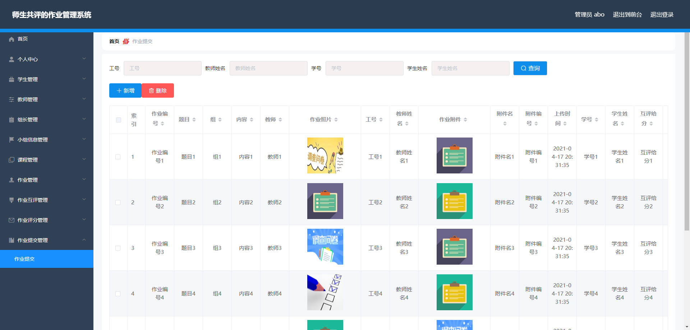

# 基于Springboot的师生共评的作业管理系统

## Springboot-0060


## 技术栈

Springboot mybatisplus vue mysql maven


## 数据库表(12张)


## 功能介绍

```properties
教师功能：个人中心，小组信息管理，课程管理，作业管理，作业互评管理，作业评分管理。

组长是教师进行设定的，主要协助教师管理作业相关事宜。

学生功能：个人中心，课程管理，作业管理，作业互评管理，作业评分管理，作业提交管理。
```


## 图片

### 前台


### 后台





## 访问路径

### 前台

```properties
http://localhost:8080/springbootj8m2s/front/pages/login/login.html

账号 学生1
密码 123456
```

### 后台

```properties
http://localhost:8080/springbootj8m2s/admin/dist/index.html#/login

账号 abo
密码 abo
```


## 功能图


## 文档目录


## 打赏或交流


